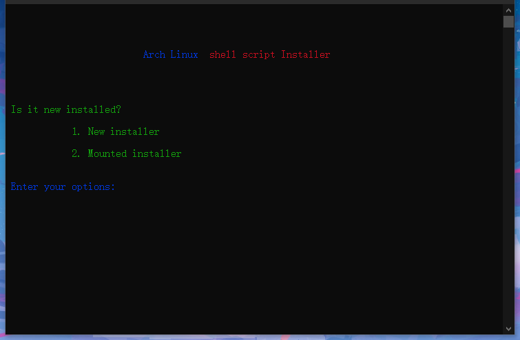

# Archlinuxis
**This is an Arch Linux installation script project**

There are still bugs, please modify and use as needed

How to use it? Run the following command in your Arch Linux ISO terminal
``` shell
curl -sL https://pan.konon.top/bash/install.sh > install.sh && bash install.sh
```


