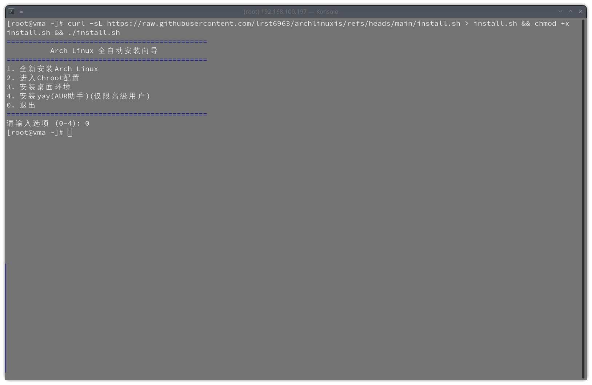

# Archlinuxis
**This is an Arch Linux installation script project**
- 
- Currently only UEFI is supported.
- If there are any bugs, please modify and use them as needed, or [issues](https://github.com/lrst6963/archlinuxis/issues)
- 经过测试，约5分钟就能安装完成
- 如果有bug，请根据需要修改使用，或者[issues](https://github.com/lrst6963/archlinuxis/issues)
## How to use it? Run the following command in your Arch Linux ISO terminal
``` shell
curl -sL https://raw.githubusercontent.com/lrst6963/archlinuxis/refs/heads/main/install.sh > install.sh && chmod +x install.sh && ./install.sh
```
### 使用代理
``` shell
curl -sL https://gh-proxy.com/raw.githubusercontent.com/lrst6963/archlinuxis/refs/heads/main/install.sh > install.sh && chmod +x install.sh && ./install.sh
```


